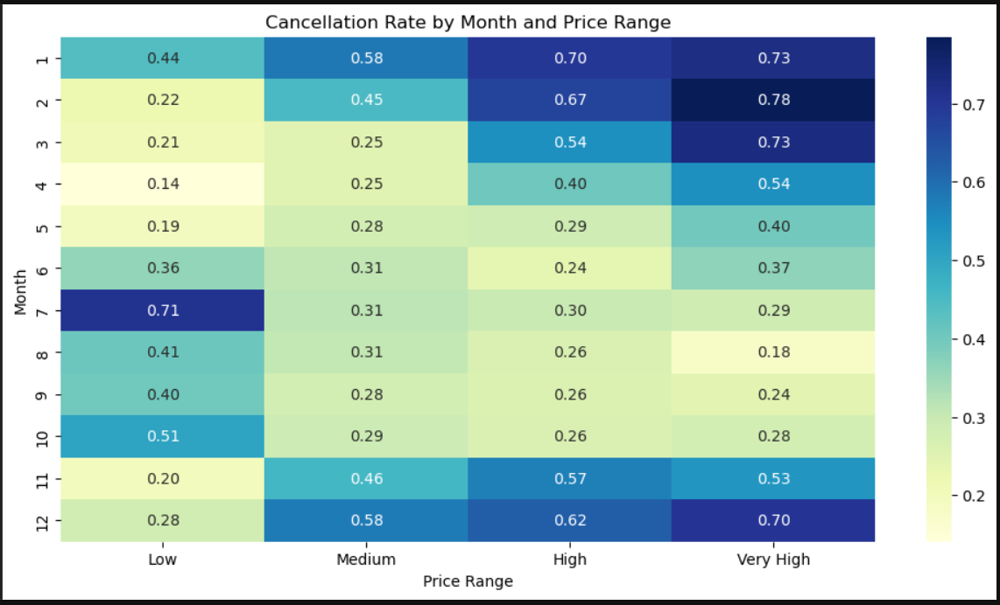
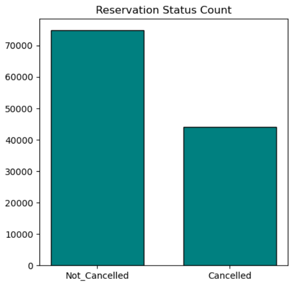

# Hotel_Reservation_Analysis_-Python-

***1- Overview*** :- 

This dataset contains hotel booking information for both a city hotel and a resort hotel. It includes details about reservations, customer demographics, stay duration, pricing (ADR), and cancellation status. The dataset is useful for analyzing booking trends, understanding customer behavior, and identifying factors that influence hotel booking cancellations.

***2- Aim*** :-

The aim of this project is to analyze hotel booking data to identify key factors affecting cancellations and uncover patterns that can help improve booking management and revenue optimization.

***3- Dataset_Used*** :- [Hotel Bookings Dataset (Excel)](https://github.com/Aniket-Rawat071199/python_hotel_reservation_analysis/blob/main/Dataset_Hotel_Booking.xls.xls)

***4-Problem_Statements*** :-

**Context:-**
In recent years, both City Hotel and Resort Hotel have experienced high cancellation rates, creating a volatile booking environment.

**The Problem:-**
High cancellations are leading to significant revenue leakage and suboptimal room utilization (occupancy rates). The unpredictability of these cancellations creates operational inefficiencies and complicates inventory management.

***5- Dataset_Description*** :-

The dataset contains booking records for a city hotel and a resort hotel, including details such as booking dates, stay duration, customer type, room type, average daily rate (ADR), and cancellation status.

***6- Usage_instructions*** :-

Load the dataset into a Python environment (e.g., Jupyter Notebook), install the required libraries (Pandas, NumPy, Matplotlib, Seaborn), run the data preprocessing steps, and execute the analysis and visualization cells to reproduce the results.

***7- Data_Preparation*** :- 

The dataset was cleaned by handling missing values, removing duplicates, correcting data types, and filtering irrelevant records. New features such as total stay duration were created, and date columns were formatted properly to ensure accurate analysis.

***8- Methodology*** :-

The methodology includes data cleaning, exploratory data analysis (EDA), data visualization, and statistical evaluation to examine booking and cancellation patterns.

***9- Visualisation*** :-

## ADR Trend

## Cancellation Rate by Months and Price Range

## Reservation Status Count

## Reservation Status of Hotels

## Reservation Status Per Month

## Top 5 Countries by Cancellations

***10- Analysis*** :-

The analysis focuses on identifying trends, seasonal effects, pricing impact (ADR), and customer characteristics that influence hotel booking cancellations.

***Conclusion*** :-

The findings provide insights into booking behavior and help suggest strategies to reduce cancellations and improve hotel revenue performance.

***11- Recommendations*** :-

1- Implement dynamic pricing strategies during high-demand periods to reduce price-sensitive cancellations.

2- Offer flexible or targeted promotions in low-demand seasons to improve booking stability.

3- Use customer segmentation to identify high-cancellation segments and apply stricter or customized booking policies.

## Author

**Aniket Rawat**  
📧 Email: arvianshrwt1999@gmail.com 
🔗 LinkedIn: www.linkedin.com/in/aniket-rawat-44a6b63aa
💻 GitHub: https://github.com/Aniket-Rawat071199
